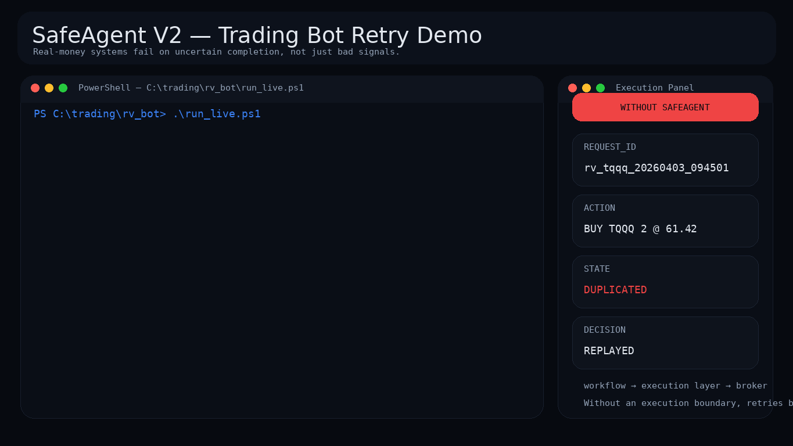
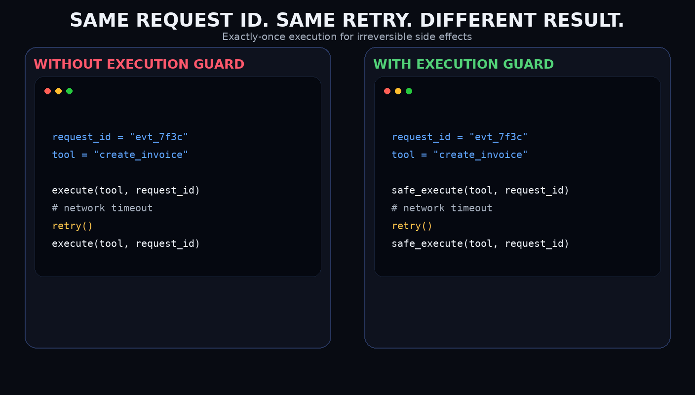
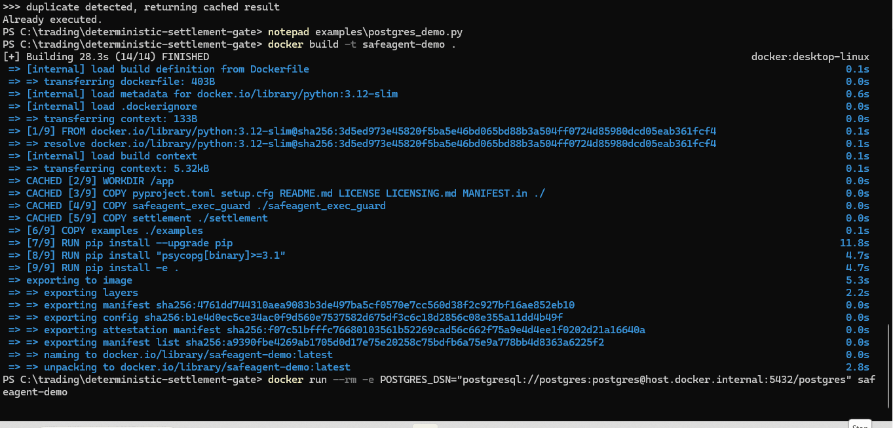

# SafeAgent

<p align="center">
  
</p>

> Deterministic execution for real-world actions under uncertainty.

---

## The Problem

Agents don’t fail on decisions.  
They fail on **uncertain completion**.

```text
submit order
timeout
retry
submit order   <-- duplicate
```

---

## Real Impact

```text
Position: 2 → 4 shares
Capital: $710.20 → $1420.40
```

Not bad logic.  
Just no execution boundary.

---

## The Fix

SafeAgent enforces:

- request identity
- execution boundary
- deterministic retry resolution

```text
timeout
retry
SafeAgent: returning cached result
```

---

## Core Idea

```text
Agent → SafeAgent → Real World
```

Retries don’t replay.  
They **resolve**.

---

## Failure Cases

- Trading → double position
- Payments → duplicate charge
- Notifications → duplicate send
- State desync → unintended re-entry

See: `failure-cases/`

---

## Demo Assets

<table>
  <tr>
    <td width="50%" valign="top">
      <h3>Before / After</h3>
      
    </td>
    <td width="50%" valign="top">
      <h3>Execution Guard</h3>
      
    </td>
  </tr>
</table>

<details>
  <summary><strong>Show Postgres runtime proof</strong></summary>
  <br>
  
</details>

### Full Video
[Download MP4](https://github.com/azender1/SafeAgent/raw/main/assets/safeagent_trading_demo_v2.mp4)

---

## Status

Reference implementation for handling duplicate execution under uncertain completion.

---

## Repo

[github.com/azender1/SafeAgent](https://github.com/azender1/SafeAgent)
